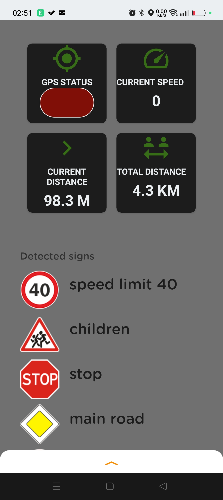
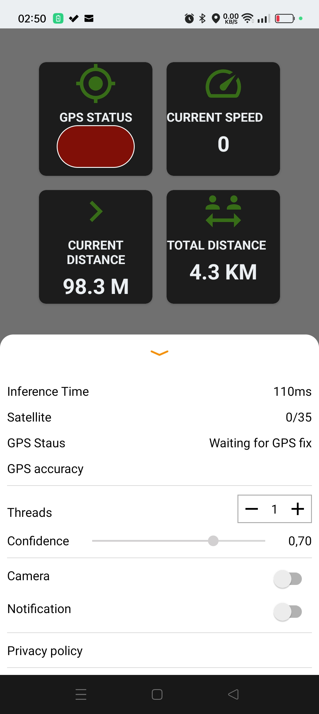
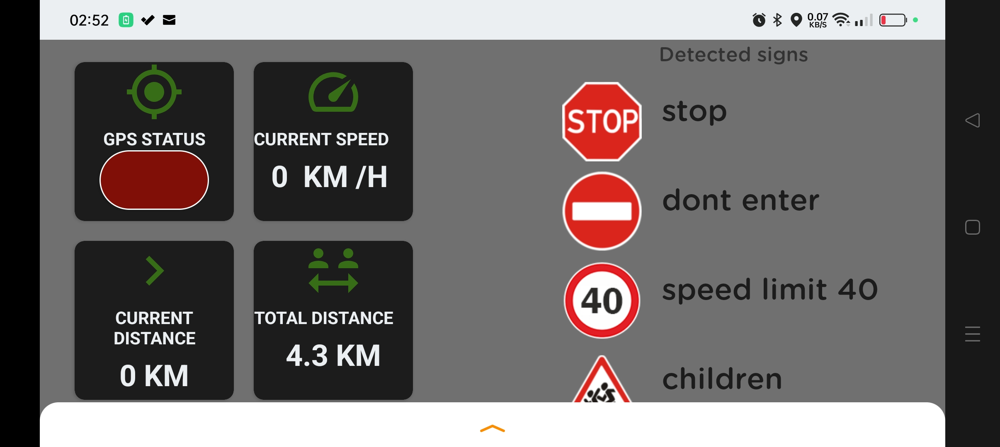
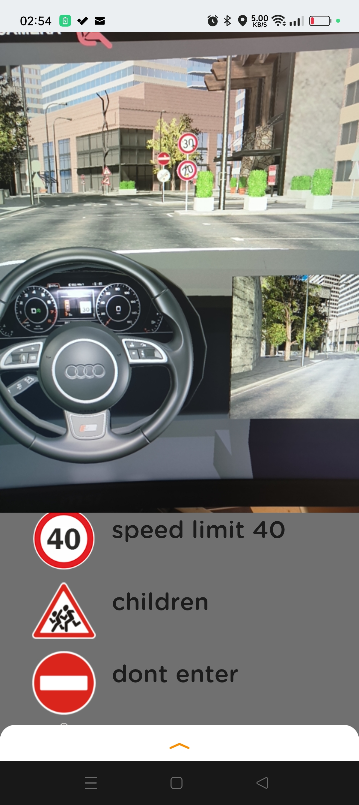
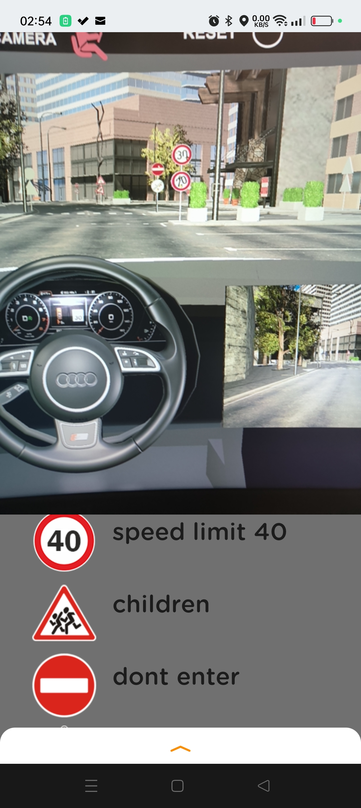
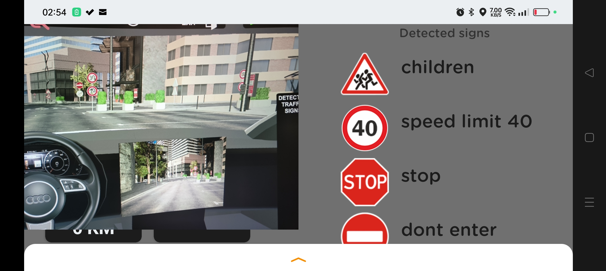
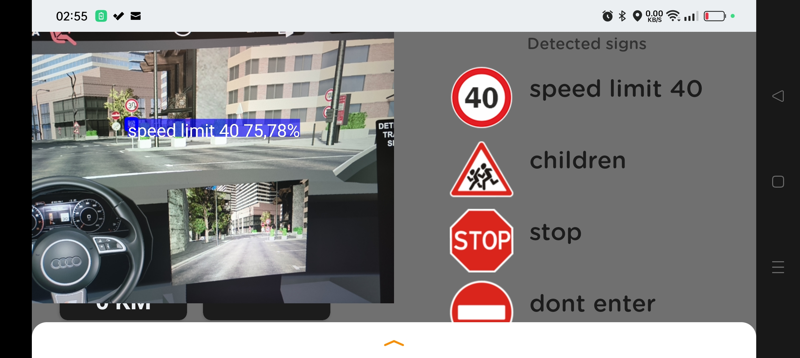

# Android Application for Traffic Sign Recognition (APTSR/Road Assistant)

Motivation

In 2020,the european commission publishes this statistic : <<  About 30% of road fatalities are caused by excessive or inappropriate speed. published main causes for driver errors in road traffic accidents with personal injury >> . On the other side of the Atlantic; the same situation can be observed in North America,in particular in the United State where 26% of all motor vehicle-related fatalities occurred in speed-related crashes.

In recent decades, new driving aid tools have been introduced on most recent vehicles. which had the effect of significantly reducing the statistics related to inattention in a driving situation.however, these new tools cannot be integrated into older generation cars. hence the idea of developing this Android AI application and integrating new advances in artificial intelligence and real-time image analysis. An affordable AI-based solution with an attractive user interface for automated speed limit and could provide real-time information about any currently valid limit to drivers of any car type, increasing security on the road significantly.

What is Android Applicationfor Traffic Sign Recognition (APTSR) ? 

APTSR is an advanced driver assistance system (ADAS) that recognizes and relays traffic sign information to drivers via the smartphone screen or instrument panel. APTSR systems can recognize speed limit signs, do not enter signs, and stop signs ...etc. APTSR aims to help make drivers more aware and able to make better safer driving decisions.  

Implementation

On this project data was extracted from German Traffic Sign Dataset.More precisely the GTSDB (https://benchmark.ini.rub.de/?section=gtsdb&subsection=dataset), was used for traffic sign recognition on images with background environment and various light conditions and the GTSRB, was used on training traffic sign classes from cropped road sign images.

This project is using Deep Learning (transfer learning) method and Tensorflow Lite, through retraining pretrained MobilenetV1 MobilenetV1,MobilenetV2,InceptionV2 models from google.

How does APTSR work ? 

Android Traffic Sign Recognition uses advanced forward-facing cameras of Android Smartphone, generally mounted to the windshield, near the rear-view mirror. The smartphone camera handles road sign detection, and software processes them to classify what certain traffic signs mean. 

 

     

Important notice:
Please note that the performance of Android Application for Traffic Sign recognition depends on several factors, such as light and weather conditions, cleanliness of the windshield, phone placement, etc.
APTSR is a camera-based feature, and its usage is highly demanding for a phone’s operation.therefore, this application may not work optimally on Smartphones that do not have sufficient computing power or older generation phones

 Who made this
--------------

| 
|---
| [VirgileDjimgou](https://github.com/VirgileDjimgou)

Contribute
----------

1. Create an issue to discuss about your idea
2. [Fork it] (https://github.com/VirgileDjimgou/Android-Application-for-Traffic-Sign-Recognition.git)
3. Create your feature branch (`git checkout -b my-new-feature`)
4. Commit your changes (`git commit -am 'Add some feature'`)
5. Push to the branch (`git push origin my-new-feature`)
6. Create a new Pull Request
7. Profit! :white_check_mark:
